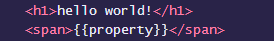
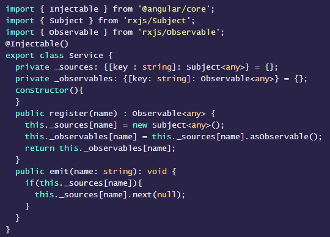

# td-highlight

`td-highlight` is an HTML wrapper `<pre><code>` tags enhanced with styling and code parser for angular2 on top of the [highlightjs lib](https://highlightjs.org/).

This implementation supports all the Common languages in highlightjs and typescript.

### Usage

Simply wrap your code snippets in `<td-highlight>`. To use HTML brackets `<` and `>` wrap the code with `<![CDATA[` and `]]>;` or replace with HTMLs character entities `&lt;` and `&gt;`. Also, to display model binding, add spaces between curly braces like: `{ { } }`

Example for HTML usage:

 ```html
<td-highlight lang="html">       
  <![CDATA[
    <h1>hello world!</h1>
    <span>{ {property} }</span>
  ]]>
</td-highlight>
 ```
 
Output: 

</img>

Example for CSS usage:

 ```html
<td-highlight lang="css">       
  pre {
    display: block;
    overflow-x: auto;
    padding: 0;
    margin: 0;
    background: #002451;
    color: white;
    font-family: Menlo, Monaco, "Andale Mono", "lucida console", "Courier New", monospace;
    line-height: 1.45;
    tab-size: 2;
    -webkit-font-smoothing: auto;
    -webkit-text-size-adjust: none;
    position: relative;
    border-radius: 2px;
  }
</td-highlight>
 ```

Output: 


 
Example for Typescript:

```html
<td-highlight lang="typescript">
  <![CDATA[
  import { Injectable } from '@angular/core';
  import { Subject } from 'rxjs/Subject';
  import { Observable } from 'rxjs/Observable';

  @Injectable()
  export class Service {

    private _sources: {[key : string]: Subject<any>} = {};
    private _observables: {[key: string]: Observable<any>} = {};

    constructor(){

    }

    public register(name) : Observable<any> {
      this._sources[name] = new Subject<any>();
      this._observables[name] = this._sources[name].asObservable();
      return this._observables[name];
    }

    public emit(name: string): void {
      if(this._sources[name]){
        this._sources[name].next(null);
      }
    }
  }
  ]]>
</td-highlight>
```

Output: 



### Upcoming work

We will also be adding src to style code from a file in an upcoming milestone.

### API Summary

Properties:

| Name | Type | Description |
| --- | --- | --- |
| `lang` | `"typescript"|"html"|"css"|[any common language supported in highlightjs]` | The language of the code thats inside the component.